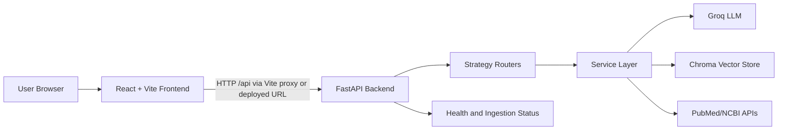
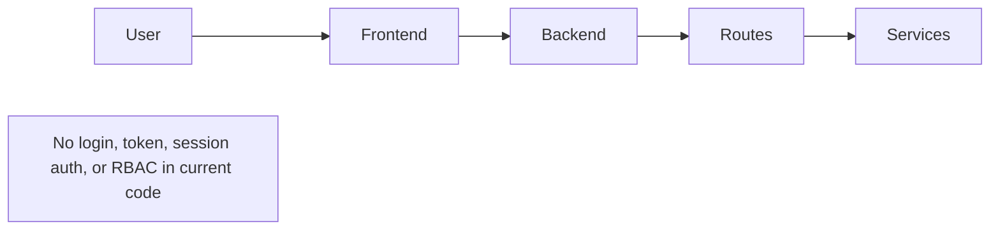
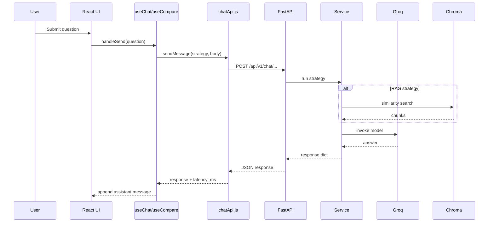
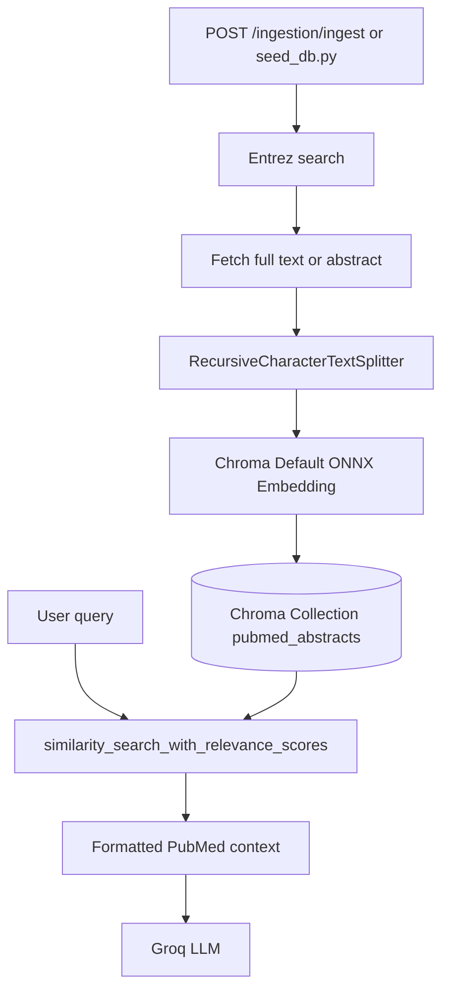
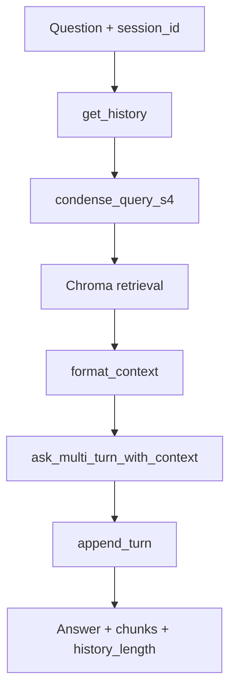
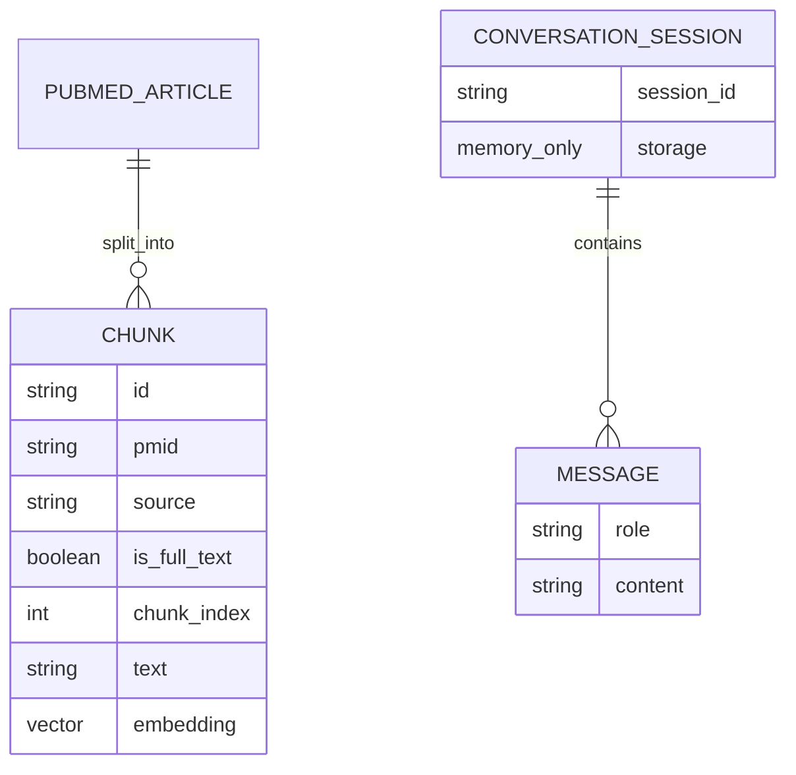
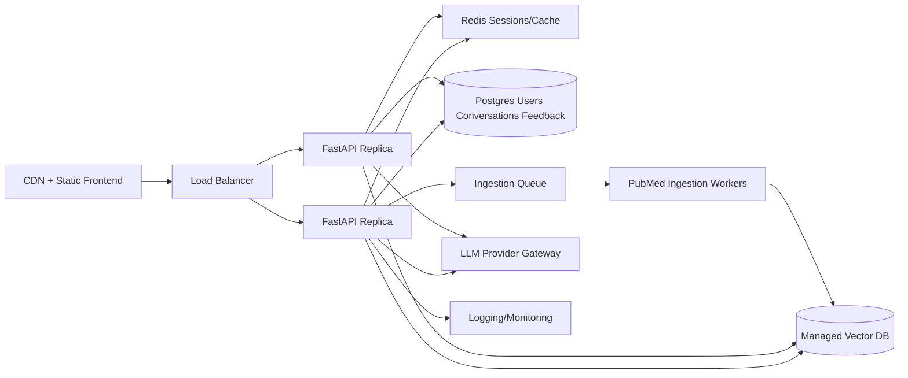

# MediQuery Project Interview Preparation

This document is based on the current repository implementation in `MediQuery-main`. It does not claim production traffic, revenue, user counts, authentication, persistent user accounts, or unimplemented features.

## Implementation Status Snapshot

### Fully Implemented In Code

- React/Vite frontend chat UI.
- Strategy selector for S1 through S5.
- Single-strategy chat flow.
- Compare Mode that sends the same question to all available strategies.
- FastAPI backend with typed Pydantic request/response schemas.
- S1 Single LLM route using Groq through LangChain.
- S2 Single RAG route using Chroma retrieval and Groq generation.
- S3 Multi-Turn LLM route using in-memory session history and query condensation.
- S4 Multi-Turn RAG route using in-memory history, query condensation, Chroma retrieval, and Groq generation.
- S5 Agent RAG route using LangGraph ReAct agent and a PubMed search tool over Chroma.
- PubMed ingestion endpoint and status endpoint.
- Startup Chroma restore/seed logic.
- Local Chroma vector store integration.
- Chroma default ONNX embedding wrapper.
- Backend tests for S1, S2, S3, S4, and ingestion.
- Evaluation scripts for S1-S4 using BERTScore, sentence-transformer similarity, NLI hallucination check, coherence, context recall, latency, token count, and cost estimate.
- Render deployment configuration for backend.

### Partially Implemented

- RAG quality depends on Chroma data being populated. The app can run with an empty Chroma collection, but RAG answers will not be meaningfully grounded.
- Conversation history is in-memory only. It is lost on backend restart and is not shared across multiple backend instances.
- Frontend recent conversations are local React state only. They are not persisted.
- Feedback buttons exist in the UI but are not persisted to the backend.
- Frontend latency is measured client-side in `chatApi.js`; backend does not return server-side latency.
- LangSmith tracing is configured through environment settings and decorators, but observability depends on configured keys.
- Evaluation scripts cover S1-S4 only; S5 Agent RAG is implemented in app/backend but not included in `evaluation/run_evaluation.py`.
- Medical safety copy exists in UI and prompts, but there is no formal clinical safety classifier.

### Planned Or Not Implemented

- Authentication, signup, login, user accounts, role-based authorization.
- Persistent database for users/conversations/feedback.
- Docker files.
- CI/CD workflow files.
- Rate limiting.
- Structured logging.
- Centralized monitoring dashboards.
- Server-side streaming responses.
- Persistent evaluation reports API.
- Full frontend unit/e2e tests.
- Production-grade secrets management beyond environment variables.

### Assumptions That Could Not Be Verified

- The project appears to be a placement/course project and may have team contributions, but exact author contribution cannot be verified from repository metadata because this folder is not a Git repository.
- README says four strategies, but current frontend/backend include S5 Agent RAG. This document treats S5 as implemented because it exists in current source.
- Local `backend/.env` exists but is intentionally not documented with secret values.

---

# 1. Project Introduction

## Project Name

MediQuery - Medical Chatbot Strategy Comparison

## One-Line Description

MediQuery is a full-stack medical question-answering app that compares different LLM, RAG, memory, and agentic retrieval strategies over clinical and biomedical questions.

## Real-World Problem

Medical AI answers can vary depending on whether the model uses only internal knowledge, retrieved literature, conversation memory, or agentic tool use. MediQuery helps users and evaluators compare those approaches side by side instead of treating a chatbot as a black box.

## Target Users

- Students learning LLM application design.
- Interviewers evaluating full-stack and AI engineering understanding.
- Researchers comparing answer strategies.
- Developers experimenting with RAG and agentic workflows.
- Educators demonstrating retrieval, memory, and evaluation trade-offs.

## Main Use Cases

- Ask a medical question and get a direct LLM answer.
- Compare RAG and non-RAG answers.
- Ask follow-up questions using memory-enabled strategies.
- Inspect PubMed source chunks returned by retrieval strategies.
- Compare all strategies side by side.
- Run offline evaluation on an Excel dataset for S1-S4.

## Why This Project Is Useful

It turns abstract AI architecture concepts into a working application. Instead of only saying "RAG improves grounding" or "memory helps follow-ups," the app exposes the actual behavior of multiple approaches using the same question.

## What Makes It Technically Interesting

- It combines frontend state management, backend API design, LLM orchestration, vector retrieval, PubMed ingestion, agentic tool calling, evaluation metrics, and deployment config.
- It demonstrates strategy-based architecture: the same user query can flow through different pipelines.
- It contains realistic AI-app concerns: API keys, retrieval quality, missing context, external API rate limits, empty vector DB state, cost tracking, and hallucination-oriented evaluation.

## My Contribution Based On Repository

A truthful interview framing:

> I worked on a full-stack medical AI comparison application. I implemented and integrated FastAPI routes for LLM and RAG strategies, connected the React UI to backend APIs, added Chroma/PubMed retrieval and ingestion support, added multi-turn memory, fixed agentic RAG compatibility with the installed LangGraph API, improved the UI/UX, and added tests around route contracts and ingestion behavior.

Avoid saying:

- "I deployed it for thousands of users."
- "It is HIPAA-compliant."
- "It guarantees medically accurate answers."
- "It has authentication and user accounts."
- "It uses a relational database."

## 30-Second Introduction

MediQuery is a full-stack medical AI chatbot built to compare different answer-generation strategies. It has a React frontend and FastAPI backend. The app supports direct LLM answers, PubMed-based RAG, multi-turn memory, memory plus RAG, and an agentic RAG strategy. The goal is to understand how retrieval, memory, and tool use change medical answer quality and source grounding.

## 60-Second Introduction

MediQuery is a medical question-answering and strategy-comparison platform. On the frontend, users can ask a clinical or biomedical question, select one strategy, or enable Compare Mode to run all available strategies side by side. The backend is built with FastAPI and exposes typed endpoints for five strategies: Simple LLM, Single RAG, Multi-Turn LLM, Multi-Turn RAG, and Agent RAG. Groq provides the LLM through LangChain, Chroma stores PubMed chunks, and Biopython/Entrez plus requests support PubMed ingestion. The project also includes an evaluation pipeline for S1-S4 that computes metrics like BERTScore, context recall, hallucination label, coherence, latency, token usage, and cost estimate.

## 2-Minute Explanation

MediQuery is a full-stack AI application for comparing medical chatbot architectures. The core problem is that different LLM strategies behave differently: a plain LLM is fast but not source-grounded, RAG can use PubMed context, memory supports follow-up questions, and agents can decide when to call retrieval tools. The app makes these differences visible.

The frontend is a React/Vite app. It has a chat workspace, strategy selector, compare mode, recent conversation drawer, source display, agent activity panel, copy/feedback actions, and a compact composer. The frontend maps each strategy to a backend endpoint in `frontend/src/api/strategies.js` and sends requests through `frontend/src/api/chatApi.js`.

The backend is a FastAPI app. `app/main.py` registers routers under `/api/v1`, configures permissive CORS, and initializes Chroma on startup. The service layer contains strategy pipelines. `llm_service.py` handles Groq calls. `rag_service.py` retrieves Chroma chunks and condenses follow-up questions. `pipeline_service.py` combines retrieval, query rewriting, and generation for S2-S4. `agent_service.py` builds a LangGraph ReAct agent for S5. `conversation_store.py` provides in-memory session history for S3/S4. `ingestion_service.py` and `seeding.py` fetch PubMed records, chunk them, and store them in Chroma.

The project is valuable in interviews because it touches full-stack engineering, AI integration, RAG, vector stores, state management, testing, deployment, and system design trade-offs.

---

# 2. Project Features

## Core Features

### 1. Single-Strategy Medical Chat

- What it does: Lets the user select one strategy and ask a medical question.
- Why needed: Enables focused testing of each architecture.
- Implementation:
  - `frontend/src/App.jsx`
  - `frontend/src/hooks/useChat.js`
  - `frontend/src/api/chatApi.js`
  - Backend route based on selected strategy.
- Flow:
  - User types question.
  - `InputBar` calls `sendSingle`.
  - `useChat.handleSend` appends user message and calls `sendMessage`.
  - `chatApi.js` posts to the chosen endpoint.
  - Backend router calls service.
  - UI appends assistant message.
- Edge cases:
  - Empty input blocked in frontend.
  - Backend validates `query` min length.
  - API errors are rendered as assistant error messages.
- Interview question:
  - Q: How does the frontend know which endpoint to call?
  - A: `frontend/src/api/strategies.js` stores each strategy id and endpoint. `chatApi.js` maps body format by strategy id.

### 2. Compare Mode

- What it does: Sends one question to all five strategies and shows independent responses.
- Why needed: It is the main comparison feature.
- Implementation:
  - `frontend/src/hooks/useCompare.js`
  - `frontend/src/components/Compare/CompareView.jsx`
  - `frontend/src/components/Compare/CompareColumn.jsx`
- Flow:
  - User toggles Compare Mode.
  - `useCompare.handleSend` adds user message to all columns.
  - It calls all strategies using `Promise.allSettled`.
  - Each column updates independently.
- Edge cases:
  - Partial failures are kept per strategy.
  - Completed results are not discarded if another strategy fails.
  - AbortController supports cancellation.
- Interview question:
  - Q: Why use `Promise.allSettled`?
  - A: Because one strategy failing should not hide other completed responses.

### 3. PubMed RAG Retrieval

- What it does: Retrieves semantically relevant PubMed chunks from Chroma.
- Why needed: It grounds responses in external medical literature.
- Implementation:
  - `backend/app/core/vector_store.py`
  - `backend/app/core/embeddings.py`
  - `backend/app/services/rag_service.py`
  - `backend/app/services/pipeline_service.py`
- Flow:
  - `rag_service.retrieve` calls `vector_store.similarity_search_with_relevance_scores`.
  - Returned documents become `RetrievedChunk` objects.
  - `format_context` builds context for the LLM.
- Edge cases:
  - Empty Chroma collection returns no chunks.
  - `top_k` is validated from 1 to 20.
- Interview question:
  - Q: What happens if no sources are returned?
  - A: The UI can show no external sources. For RAG prompts, the model is instructed to say if context is insufficient.

### 4. Multi-Turn Memory

- What it does: Maintains conversation turns for S3 and S4.
- Why needed: Follow-up questions like "How is it treated?" need prior context.
- Implementation:
  - `backend/app/services/conversation_store.py`
  - `backend/app/routers/multi_turn_llm.py`
  - `backend/app/routers/multi_turn_rag.py`
- Flow:
  - Frontend creates session ids using `makeSessionId`.
  - Backend fetches history by session id.
  - Pipeline condenses recent context.
  - Backend appends turn and caps history by `MAX_HISTORY_TURNS`.
- Edge cases:
  - Independent sessions are isolated by session id.
  - Clear endpoints delete session history.
- Interview question:
  - Q: Why is current memory not production-ready?
  - A: It is process-local memory; it disappears on restart and does not work across multiple backend replicas.

### 5. Agent RAG

- What it does: Uses a LangGraph ReAct agent with a `search_pubmed` tool.
- Why needed: More flexible than one fixed retrieval call.
- Implementation:
  - `backend/app/services/agent_service.py`
  - `backend/app/routers/agent_rag.py`
- Flow:
  - Router calls `run_agent`.
  - Agent receives user query and system prompt.
  - Agent may call `search_pubmed`.
  - Tool logs query and number of chunks found.
  - Final response includes answer, retrieved chunks, tool call log, and token totals.
- Edge cases:
  - Recursion limit is set to 10.
  - Empty retrieval returns "No relevant PubMed abstracts found".
- Interview question:
  - Q: Do you show chain-of-thought?
  - A: No. The UI only shows safe tool-call summaries, not hidden reasoning.

### 6. PubMed Ingestion

- What it does: Fetches PubMed records, chunks text, and stores new chunks in Chroma.
- Why needed: RAG needs a populated vector database.
- Implementation:
  - `backend/app/services/ingestion_service.py`
  - `backend/app/services/seeding.py`
  - `backend/app/routers/ingestion.py`
- Edge cases:
  - Missing `PUBMED_EMAIL` returns HTTP 400.
  - Existing chunk ids are skipped.
  - NCBI key changes request sleep interval.
- Interview question:
  - Q: How do you avoid duplicate vector chunks?
  - A: IDs use `pmid_chunk_index`, and ingestion checks existing ids before adding new chunks.

## Supporting Features

- Health endpoint: `/health`.
- CORS middleware.
- Environment-based settings.
- Chroma backup restore on startup.
- Source display with PubMed links.
- Theme toggle.
- Emergency language notice in frontend.
- Client-side latency measurement.
- Request cancellation.
- Frontend copy and feedback UI.

## Admin Features

There is no implemented admin panel, admin role, or protected admin feature.

## User Features

- Ask questions.
- Select strategy.
- Compare all strategies.
- Start new chat.
- Clear memory-backed sessions indirectly via new chat.
- Open sources.
- Copy answer.
- Toggle light/dark theme.

## Security Features

- Pydantic request validation.
- Environment variables for secrets.
- `.gitignore` excludes `backend/.env`.
- Safe external PubMed links use `target="_blank"` and `rel="noreferrer"`.
- No unsafe HTML rendering of model output.

## Analytics Or Reporting Features

- Evaluation script writes Excel reports for S1-S4.
- Metrics include label accuracy, BERTScore F1, hallucination label, context recall, coherence, latency, token usage, and cost estimate.

## Incomplete Or Future Features

- Authentication and user accounts.
- Persistent conversations.
- Persisted feedback.
- Backend support for streaming.
- Production observability.
- S5 in evaluation script.
- Rate limiting and abuse protection.
- Full clinical safety guardrails.

---

# 3. Technology Stack

| Technology | Used In | Why Selected | Benefits | Limitations | Alternatives | When Alternative Is Better |
|---|---|---|---|---|---|---|
| JavaScript | Frontend | Native React/Vite language | Fast dev, browser-native | No static typing | TypeScript | Larger teams, stricter contracts |
| React 18 | Frontend UI | Component-based app | Reusable components, hooks | Requires client-side state discipline | Vue, Svelte, Angular | Angular for enterprise structure |
| Vite | Frontend build/dev | Fast dev server | Simple config, fast builds | Minimal built-in testing | Next.js | SSR, routing, SEO needs |
| CSS Modules | Styling | Scoped component CSS | No global class collisions | Manual design system work | Tailwind, MUI | Faster standardized UI |
| FastAPI | Backend API | Python async-friendly API framework | Pydantic validation, docs | Sync services can still block | Django, Flask | Django for batteries-included auth/admin |
| Pydantic | Schemas/settings | Typed validation | Clear request/response contracts | Runtime validation overhead | Marshmallow | Non-Pydantic ecosystems |
| LangChain | LLM orchestration | Common LLM abstractions | Integrates Groq, messages, tracing | API churn risk | Direct SDK calls | Simpler apps with one provider |
| LangGraph | Agent RAG | ReAct agent workflow | Tool-use orchestration | More complexity | Custom loop | Small deterministic pipelines |
| Groq | LLM provider | Runs `llama-3.3-70b-versatile` | Fast hosted inference | External dependency, rate limits | OpenAI, Anthropic, local LLM | Enterprise compliance/provider preference |
| ChromaDB | Vector store | Local persisted vector retrieval | Easy local RAG | Not ideal for massive distributed scale | Pinecone, Weaviate, pgvector | Production-scale managed vector search |
| Chroma default ONNX embedding | Embeddings | Avoids torch in backend runtime | Lightweight dependency | Less customizable | SentenceTransformers | Higher retrieval quality experiments |
| Biopython Entrez | PubMed search/fetch | Official NCBI access library | PubMed-focused | Requires email and rate limits | NCBI HTTP APIs directly | Fine-grained HTTP control |
| requests | Backup/full-text fetch | Simple HTTP calls | Easy streaming/download | Blocking | httpx | Async operations |
| pytest | Backend tests | Python testing standard | Mocks, fixtures, simple assertions | No frontend coverage | unittest, nose | Legacy codebases |
| httpx | Evaluation/API tests | HTTP client | Sync/async support | None significant here | requests | Simple scripts |
| pandas/openpyxl | Evaluation | Excel dataset/report IO | Strong tabular support | Heavy dependency | csv module | Very simple CSV workflows |
| BERTScore | Evaluation metric | Semantic similarity | Better than exact match | Model download/slow | ROUGE, BLEU | Summarization or lexical tasks |
| SentenceTransformers | Evaluation metrics | Embedding similarity | Useful for recall/coherence | Heavy model dependency | OpenAI embeddings | Managed embedding service |
| Render | Deployment config | Simple Python web deployment | Minimal YAML | Backend-only config | Railway, Fly.io, AWS | More infra control |

No ORM, SQL database, auth framework, Docker, queue, cache layer, or CI/CD is present in the repository.

---

# 4. System Architecture

## High-Level Architecture



## Frontend Architecture

- `App.jsx` owns top-level UI state: compare mode, sidebar open, theme, recent conversations.
- `useChat.js` handles single strategy messages, loading, abort, and session id.
- `useCompare.js` handles per-strategy columns and partial failures.
- `chatApi.js` centralizes POST requests and latency measurement.
- Component folders separate header, sidebar, chat, input, and compare UI.

## Backend Architecture

- Layered FastAPI app:
  - Routes: request handling and HTTP status mapping.
  - Schemas: Pydantic validation.
  - Services: LLM, RAG, pipelines, ingestion, conversation memory.
  - Core: vector store and embeddings.
- Dependencies are mostly function imports and FastAPI `Depends`.

## Database Architecture

The project does not use a relational database. It uses ChromaDB as a vector store:

- Local persisted directory: `backend/chroma_db` when present.
- Collection: `pubmed_abstracts`.
- Stored item:
  - text chunk
  - metadata: PMID, source URL, full-text flag, chunk index
  - id: `pmid_chunk_index`

## Authentication Flow

No authentication flow exists.



## Request-Response Flow



## Database Interaction Diagram



## Important Feature Workflow: S4 Multi-Turn RAG



## Deployment Flow

```mermaid
flowchart LR
    Repo[Repository] --> Render[Render Web Service]
    Render --> Build[pip install -r requirements.txt]
    Build --> Start[uvicorn app.main:app --host 0.0.0.0 --port $PORT]
    Start --> Health[/health]
    Render --> Env[Dashboard Environment Variables]
```

---

# 5. Folder Structure

```text
MediQuery-main/
  README.md
  render.yaml
  backend/
    app/
      main.py
      config.py
      dependencies.py
      models/schemas.py
      routers/
      services/
      core/
    tests/
    requirements.txt
    seed_db.py
  frontend/
    src/
      App.jsx
      api/
      hooks/
      components/
      styles/
    package.json
    vite.config.js
  evaluation/
    run_evaluation.py
    metrics.py
    dataset/
    strategy_performance_evaluations/
```

## Root

- `README.md`: setup, API overview, evaluation instructions.
- `render.yaml`: backend deployment on Render.

## Backend

- `backend/app/main.py`: app creation, CORS, startup Chroma seed/restore, router registration, health endpoint.
- `backend/app/config.py`: environment settings with Pydantic BaseSettings.
- `backend/app/models/schemas.py`: request/response contracts.
- `backend/app/routers`: HTTP endpoints by feature/strategy.
- `backend/app/services`: business logic and orchestration.
- `backend/app/core`: embedding and Chroma vector store setup.
- `backend/tests`: mocked backend route/service tests.
- `backend/seed_db.py`: CLI for full PubMed seeding.

## Frontend

- `frontend/src/App.jsx`: top-level UI composition and state.
- `frontend/src/api`: strategy definitions and fetch wrapper.
- `frontend/src/hooks`: single and compare chat state.
- `frontend/src/components`: UI components.
- `frontend/src/styles/variables.css`: design tokens and dark theme.
- `frontend/vite.config.js`: dev server and `/api` proxy to backend.

## Evaluation

- `evaluation/run_evaluation.py`: calls S1-S4 APIs and writes Excel results.
- `evaluation/metrics.py`: BERTScore, hallucination NLI, context recall, coherence, cost.
- `evaluation/dataset`: Excel dataset.
- `evaluation/strategy_performance_evaluations`: existing result workbooks.

---

# 6. End-to-End Application Flow

## User Opens App

1. Browser loads `frontend/index.html`.
2. React starts from `frontend/src/main.jsx`.
3. `App.jsx` renders `Header`, optional `Sidebar`, `ChatWindow` or `CompareView`, and `InputBar`.
4. Theme preference is read from `localStorage`.
5. User sees welcome panel and composer.

## Single Strategy Question

```text
User submits question
-> InputBar.submit
-> App.sendSingle
-> useChat.handleSend
-> chatApi.sendMessage
-> FastAPI route
-> service/pipeline
-> Groq and possibly Chroma
-> JSON response
-> useChat appends assistant message
-> MessageBubble displays answer, metadata, sources, tool calls
```

## Compare Mode Question

```text
User toggles Compare Mode
-> App renders CompareView
-> InputBar sends same text
-> useCompare.handleSend
-> Promise.allSettled across STRATEGIES
-> each endpoint is called independently
-> each CompareColumn updates independently
-> Comparison summary counts completed, failed, sources, fastest
```

## RAG Retrieval Flow

```text
Question
-> router single_rag/multi_turn_rag/agent_rag
-> get_vector_store dependency
-> rag_service.retrieve
-> Chroma similarity search
-> RetrievedChunk list
-> context string
-> LLM prompt
-> answer + chunks returned
```

## PubMed Ingestion Flow

```text
POST /api/v1/ingestion/ingest
-> ingestion router
-> ingestion_service.ingest
-> validate PUBMED_EMAIL
-> Entrez search
-> fetch full text or abstract
-> split into chunks
-> skip existing chunk ids
-> vector_store.add_texts
-> update seeding state
-> return documents_ingested
```

---

# 7. Database Design

## Current Database

There is no SQL database and no ORM. The only data persistence layer is ChromaDB, used as a vector store.

## Chroma Collection Summary

| Field | Meaning |
|---|---|
| collection | `pubmed_abstracts` |
| document text | PubMed title/abstract/full-text chunk |
| id | `{pmid}_chunk_{chunk_index}` |
| metadata.pmid | PubMed ID |
| metadata.source | PubMed URL |
| metadata.is_full_text | Boolean-like metadata |
| metadata.chunk_index | Chunk order |
| embedding | Generated by Chroma default ONNX embedding wrapper |

## ER-Style Diagram



Note: `CONVERSATION_SESSION` and `MESSAGE` are in-memory Python data structures, not persisted DB tables.

## Validation And Constraints

- Pydantic validates request bodies.
- `top_k` is constrained to 1-20.
- `max_results` is constrained to 1-1000.
- Chunk ID strategy prevents duplicate chunk insertion during ad-hoc ingestion.

## Missing Database Features

- No relational schema.
- No migrations.
- No indexes explicitly defined in repository.
- No transactions.
- No user table.
- No persistent conversation table.

## Database Interview Questions

1. Q: What database is used?
   A: ChromaDB, used as a vector database for PubMed chunks.
2. Q: Is there an ORM?
   A: No. The backend uses LangChain Chroma wrapper and Chroma collection APIs.
3. Q: How are duplicates avoided?
   A: Chunk ids are deterministic using PMID and chunk index.
4. Q: What would you add for production?
   A: A relational DB for users/conversations/feedback and a managed vector DB for retrieval scale.
5. Q: Are conversations durable?
   A: No, current session memory is in-memory.

---

# 8. API Documentation

| Method | Endpoint | Purpose | Auth | Request | Response | Errors | Source |
|---|---|---|---|---|---|---|---|
| GET/HEAD | `/health` | Health check | None | None | `{"status":"ok"}` | N/A | `app/main.py` |
| POST | `/api/v1/chat/single-llm/` | S1 direct LLM | None | `{query}` | answer, strategy, model, tokens | 422, 500 | `routers/single_llm.py` |
| POST | `/api/v1/chat/single-rag/` | S2 retrieve then answer | None | `{query, top_k}` | answer, chunks, model, tokens | 422, 500 | `routers/single_rag.py` |
| POST | `/api/v1/chat/multi-turn-llm/` | S3 memory LLM | None | `{session_id, query}` | answer, session_id, history_length, tokens | 422, 500 | `routers/multi_turn_llm.py` |
| DELETE | `/api/v1/chat/multi-turn-llm/{session_id}` | Clear S3 memory | None | path param | 204 | N/A | `routers/multi_turn_llm.py` |
| POST | `/api/v1/chat/multi-turn-rag/` | S4 memory RAG | None | `{session_id, query, top_k}` | answer, chunks, history_length, tokens | 422, 500 | `routers/multi_turn_rag.py` |
| DELETE | `/api/v1/chat/multi-turn-rag/{session_id}` | Clear S4 memory | None | path param | 204 | N/A | `routers/multi_turn_rag.py` |
| POST | `/api/v1/chat/agent-rag/` | S5 agent RAG | None | `{query, top_k}` | answer, tool_calls, chunks, model, tokens | 422, 500 | `routers/agent_rag.py` |
| POST | `/api/v1/ingestion/ingest` | Ingest PubMed records | None | `{query, max_results}` | status, documents_ingested, message | 400, 422, 500 | `routers/ingestion.py` |
| GET | `/api/v1/ingestion/status` | Chroma and seed status | None | None | collection, count, seed state | 500 | `routers/ingestion.py` |

## Detailed API Flow 1: S2 Single RAG

1. Frontend calls `/api/v1/chat/single-rag/` with `query` and `top_k`.
2. Pydantic validates `query` and `top_k`.
3. FastAPI injects `vector_store` using `get_vector_store`.
4. Router calls `run_s2`.
5. `run_s2` calls `rag_service.retrieve`.
6. Chroma returns documents and relevance scores.
7. `format_context` prepares PubMed context.
8. `llm_service.ask_with_context` calls Groq.
9. Router returns `SingleRAGResponse`.

## Detailed API Flow 2: S3 Multi-Turn LLM

1. Frontend sends `session_id` and `query`.
2. Router calls `get_history(session_id)`.
3. `run_s3` condenses query with recent history.
4. It calls `ask_multi_turn` with condensed query.
5. Router appends condensed query and answer to memory.
6. Response includes `history_length`.

## Detailed API Flow 3: PubMed Ingestion

1. Client posts query and max results.
2. Router injects settings and vector store.
3. `ingestion_service.ingest` validates `PUBMED_EMAIL`.
4. Entrez searches PubMed.
5. Full text or abstract is fetched.
6. Text is split into chunks.
7. Existing chunk ids are skipped.
8. New chunks are added to Chroma.
9. Status state is updated and response returned.

---

# 9. Authentication and Security

## Authentication

No authentication is implemented. There is no login, signup, JWT, session cookie, password storage, refresh token, or user menu backed by identity.

## Authorization

No role-based access control exists. All endpoints are public if the backend is reachable.

## Input Validation

- Pydantic schemas validate required fields and ranges.
- Empty query returns 422.
- `top_k` must be 1-20.
- `max_results` must be 1-1000.
- Missing `PUBMED_EMAIL` for ingestion returns 400.

## CORS

`app/main.py` sets:

- `allow_origins=["*"]`
- `allow_methods=["*"]`
- `allow_headers=["*"]`

This is convenient for development but too permissive for production.

## XSS

The frontend renders model output as text in React, not as raw HTML. That reduces XSS risk from model output. It does not render Markdown as HTML.

## CSRF

No CSRF protection is implemented. Since there is no cookie-authenticated session, CSRF risk is different, but public POST endpoints can still be abused.

## Secrets Management

- Secrets are read from environment variables.
- `backend/.gitignore` excludes `.env`.
- `render.yaml` marks sensitive env vars as `sync: false`.
- Do not expose `GROQ_API_KEY` or `NCBI_API_KEY` in frontend.

## Security Weaknesses

- No authentication or rate limiting.
- Wide-open CORS.
- Error messages may expose exception text.
- No request-size limits beyond schema constraints.
- No prompt-injection defense for RAG context.
- No audit logs.
- No formal medical safety classifier.

## Security Interview Questions

1. Q: How are secrets handled?
   A: Through environment variables via Pydantic settings; `.env` is ignored locally and Render secrets are configured externally.
2. Q: Is the API protected?
   A: No. This is a major production gap.
3. Q: How would you secure it?
   A: Add auth, restrict CORS, rate limiting, request logging, secret management, and user-level quotas.
4. Q: How do you prevent XSS from model output?
   A: Current React UI renders text, not unsafe HTML. If Markdown is added, sanitize it.
5. Q: Is this medical advice?
   A: No. The UI and prompts frame it as educational information only.

---

# 10. Important Code Walkthroughs

## 1. `frontend/src/App.jsx`

- Responsibility: top-level layout, theme, compare mode, sidebar, recent conversation state.
- Key functions: `sendSingle`, `sendCompare`, `newConversation`, `cycleTheme`.
- Dependencies: `useChat`, `useCompare`, UI components.
- Improvement: persist conversation history in backend instead of local state.

## 2. `frontend/src/hooks/useChat.js`

- Responsibility: single-strategy chat state.
- Key functions: `handleSend`, `handleStop`, `handleNewChat`, `handleStrategyChange`.
- Uses `AbortController` to cancel requests.
- Improvement: preserve failed input more explicitly and add retry action per message.

## 3. `frontend/src/hooks/useCompare.js`

- Responsibility: parallel per-strategy compare state.
- Uses `Promise.allSettled` to support partial success.
- Improvement: retry a single failed strategy.

## 4. `frontend/src/api/chatApi.js`

- Responsibility: HTTP POST helper and strategy body mapping.
- Adds `latency_ms` client-side.
- Improvement: shared timeout handling and richer error object.

## 5. `backend/app/main.py`

- Responsibility: FastAPI app setup, lifespan startup, CORS, routers, health.
- Important behavior: background thread initializes Chroma, restores backup, or seeds from PubMed.
- Improvement: structured startup logs and safer tar extraction.

## 6. `backend/app/config.py`

- Responsibility: typed environment settings.
- Uses `@lru_cache` to avoid recreating settings.
- Improvement: validate required keys per endpoint at startup or expose config status.

## 7. `backend/app/models/schemas.py`

- Responsibility: API contracts.
- Contains request and response classes for all strategies.
- Improvement: add richer source metadata if backend fetches titles/authors/journals.

## 8. `backend/app/services/llm_service.py`

- Responsibility: Groq model calls for S1-S4.
- Uses LangChain messages and system prompts.
- Improvement: centralize provider error handling and timeouts.

## 9. `backend/app/services/rag_service.py`

- Responsibility: retrieval, context formatting, and query condensation.
- Uses Chroma relevance search.
- Improvement: threshold filtering and better citation formatting.

## 10. `backend/app/services/pipeline_service.py`

- Responsibility: S2-S4 orchestration.
- Pattern: strategy pipeline functions.
- Improvement: return structured intermediate metadata for UI/evaluation.

## 11. `backend/app/services/agent_service.py`

- Responsibility: S5 agentic RAG.
- Uses closure factory `_make_search_tool` to collect tool calls and chunks.
- Improvement: include agent in evaluation and add stricter max tool-call policy.

## 12. `backend/app/services/ingestion_service.py`

- Responsibility: ad-hoc PubMed ingestion.
- Handles missing email, dedupe, state update.
- Improvement: run as background job for long ingestion.

## 13. `backend/app/services/seeding.py`

- Responsibility: bulk PubMed seeding across domain queries.
- Handles search, fetch, chunking, storage, progress state.
- Improvement: resumable job checkpoint and backoff on external failures.

## 14. `backend/app/core/vector_store.py`

- Responsibility: Chroma client creation.
- Uses `@lru_cache(maxsize=1)`.
- Improvement: health checks for remote Chroma and configurable SSL/auth.

## 15. `evaluation/metrics.py`

- Responsibility: evaluation metrics and model singletons.
- Improvement: document metric limitations clearly and add S5 support.

---

# 11. Engineering Decisions

## Monolithic Backend

- Problem: Need a simple API for several strategies.
- Approach: One FastAPI app with route modules.
- Advantages: Easy local development, simple deployment.
- Disadvantages: Long ingestion or LLM calls can affect API process.
- Scale change: Split ingestion/evaluation into background workers.

## REST Instead Of GraphQL

- Problem: Need predictable chat endpoints.
- Approach: REST routes.
- Advantages: Simple, self-documenting with FastAPI docs.
- Disadvantages: More endpoints for each strategy.
- Alternative: GraphQL if clients need flexible nested data.

## Chroma Vector Store Instead Of SQL

- Problem: Need semantic retrieval over PubMed text.
- Approach: Chroma collection.
- Advantages: Simple local vector search.
- Disadvantages: Not a general transactional database.
- Scale change: Managed vector DB plus relational DB.

## In-Memory Conversation Store

- Problem: Need quick multi-turn memory.
- Approach: Python `defaultdict`.
- Advantages: Simple and fast.
- Disadvantages: Not durable or multi-instance safe.
- Scale change: Redis or database-backed sessions.

## Client-Side State With React Hooks

- Problem: App state is small and local.
- Approach: `useState`, `useRef`, custom hooks.
- Advantages: No extra dependency.
- Disadvantages: Harder as features grow.
- Alternative: Zustand/Redux Query if state grows.

## Synchronous LLM Calls

- Problem: Simpler route implementation.
- Approach: sync functions call LLM services.
- Advantages: Easier testing and reading.
- Disadvantages: Blocks workers during external calls.
- Scale change: async clients, queues, streaming.

## Environment-Based Secrets

- Problem: API keys should not be hard-coded.
- Approach: Pydantic settings and Render env vars.
- Advantages: Standard and safe for local/deploy.
- Disadvantages: No secret rotation automation.
- Scale change: managed secret vault.

---

# 12. Design Patterns and Principles

| Pattern/Principle | Where Used | Benefit | Improvement |
|---|---|---|---|
| Layered architecture | routers/services/core/models | Separates HTTP, business logic, and infrastructure | Add repository interfaces for persistence |
| Strategy pattern | S1-S5 endpoint/pipeline variants | Same query can use different algorithms | Define common strategy interface |
| Service layer | `backend/app/services` | Keeps routers thin | Standardize error objects |
| Dependency injection | FastAPI `Depends(get_vector_store)` | Testable dependencies | Add provider interfaces |
| Singleton/cache | `@lru_cache` settings/vector/embedding | Avoid repeated expensive setup | Add cache invalidation strategy |
| Factory/closure | `_make_search_tool` in agent service | Captures chunks/tool logs | Return typed trace object |
| Adapter | `_ChromaEmbedWrapper` | Adapts Chroma embedding function to LangChain interface | Add tests for embedding dimensions |
| Reusable components | React component folders | UI maintainability | Add frontend tests |
| Middleware pattern | CORS middleware | Cross-origin dev access | Restrict production origins |

Do not overclaim SOLID. The code has separation of concerns, but it is not a formally abstracted enterprise design.

---

# 13. Scalability Analysis

## At 100 Users

- Likely works if Groq rate limits and backend worker count are sufficient.
- Chroma local disk can handle small retrieval workloads.
- In-memory sessions are acceptable for one process.

## At 10,000 Users

- Current design will struggle.
- Bottlenecks:
  - External LLM rate limits.
  - Local Chroma single-node storage.
  - No rate limiting.
  - In-memory sessions not shared.
  - Blocking ingestion and model calls.
- Improvements:
  - Multiple backend replicas.
  - Redis for sessions.
  - Managed vector DB.
  - Queue ingestion.
  - Rate limiting and quotas.

## At 1 Million Users

- Current implementation is not sufficient.
- Needed:
  - Load balancer.
  - Stateless backend replicas.
  - Managed vector DB cluster.
  - Persistent relational DB.
  - CDN for frontend.
  - LLM provider abstraction and fallback.
  - Caching for common retrieval queries.
  - Observability and incident response.

## High Read Traffic

- Cache static frontend.
- Cache frequent retrieval results.
- Use read-scaled vector search.

## High Write Traffic

- Ingestion writes should be queued.
- Deduplication should be centralized.
- Add idempotency keys for ingestion jobs.

## External-Service Failures

- Current app returns 500 on most service failures.
- Add retries, backoff, circuit breaker, and user-friendly status.

---

# 14. Performance Analysis

| Area | Potential Issue | Impact | Measure | Improvement |
|---|---|---|---|---|
| Frontend compare | Five simultaneous API calls | UI waits for slow strategies | browser network panel | Per-strategy streaming/progress |
| Frontend messages | Long histories render fully | Slow UI with huge chats | React profiler | Virtualize long histories |
| Backend LLM | External latency | Slow answers | timing logs | async calls, streaming |
| Backend RAG | Empty or large Chroma | poor retrieval or slow search | query latency | indexes/managed vector DB |
| Ingestion | PubMed fetch loop is blocking | endpoint can run long | request duration | background jobs |
| Evaluation | model downloads/heavy scoring | slow local runs | script timing | cache models, batch scoring |
| Error handling | raw exception strings | noisy UX/security risk | error logs | typed errors |
| Repeated calls | Compare mode hits all strategies every question | cost/rate pressure | token and request logs | cache and quotas |

---

# 15. Reliability and Failure Handling

## Current Handling

- Invalid input: Pydantic 422 and frontend empty-input validation.
- LLM failure: route returns 500; UI shows error message.
- RAG empty state: chunks can be empty; UI can show no sources.
- PubMed missing email: 400.
- Duplicate ingestion chunks: skipped by existing ids.
- Partial compare failure: successful columns remain visible.
- Cancellation: frontend uses AbortController.
- App restart: in-memory sessions and frontend local conversations are lost.
- Health check: `/health`.

## Recommended Improvements

- Retry transient Groq/PubMed errors with exponential backoff.
- Circuit breaker for external LLM/provider outages.
- Structured logs with request ids.
- Persistent job table for ingestion.
- Graceful shutdown.
- Dead-letter queue for failed ingestion jobs.
- Monitoring and alerting.
- Idempotency for ingestion requests.

---

# 16. Testing Strategy

## Existing Tests

Backend tests in `backend/tests` cover:

- S1 success, validation, failure.
- S2 validation, success, failure.
- S3 response, memory increment, independent sessions, clear session.
- S4 response, validation, clear session.
- Ingestion status, endpoint success, missing email, dedupe.

The tests use `unittest.mock.patch`, FastAPI `TestClient`, and dependency overrides.

## Missing Tests

- S5 Agent RAG route tests.
- Frontend unit tests.
- End-to-end browser tests.
- Real Chroma integration tests.
- PubMed fetch integration tests.
- Startup seed/backup restore tests.
- Security tests.
- Load tests.

## Sample Test Scenarios

- Successful S1 with mocked Groq.
- S2 with no chunks returned.
- S4 follow-up question with history.
- S5 tool call log returned.
- Ingestion duplicate PMID.
- Missing `PUBMED_EMAIL`.
- Groq timeout.
- Chroma unavailable.
- Compare Mode partial failure.
- UI cancellation.

---

# 17. Deployment and DevOps

## Local Run

Backend:

```bash
cd backend
python -m venv .venv
.\.venv\Scripts\activate
pip install -r requirements.txt
uvicorn app.main:app --reload
```

Frontend:

```bash
cd frontend
npm install
npm run dev
```

## Environment Variables

Important:

- `GROQ_API_KEY`
- `GROQ_MODEL`
- `PUBMED_EMAIL`
- `NCBI_API_KEY`
- `CHROMA_HOST`
- `CHROMA_PORT`
- `CHROMA_PERSIST_DIR`
- `CHROMA_COLLECTION`
- `CHROMA_BACKUP_URL`
- `TEMPERATURE`
- `MAX_HISTORY_TURNS`
- `LANGSMITH_API_KEY`
- `LANGCHAIN_TRACING_V2`

## Build Process

- Frontend: `npm run build`.
- Backend: `pip install -r requirements.txt`.

## Docker

No Dockerfile or docker-compose file is present.

## CI/CD

No GitHub Actions or CI config is present.

## Deployment

`render.yaml` defines a Render Python web service:

- root: `backend`
- build: `pip install -r requirements.txt`
- start: `uvicorn app.main:app --host 0.0.0.0 --port $PORT`
- health: `/health`

## Deployment Checklist

- Set `GROQ_API_KEY`.
- Set `PUBMED_EMAIL`.
- Optionally set `NCBI_API_KEY`.
- Configure `CHROMA_BACKUP_URL` or seed Chroma.
- Restrict CORS origins.
- Configure logging.
- Add rate limiting.
- Confirm health check.
- Run backend tests.
- Run frontend build.
- Ensure frontend deployment target is configured separately.

---

# 18. Challenges and Solutions

## Challenge 1: Comparing Multiple AI Strategies

- Situation: The project needed to compare multiple answer generation approaches.
- Task: Keep each strategy separate but reusable.
- Action: Implemented dedicated endpoints and shared pipeline/service utilities.
- Result: Users can run one strategy or compare all strategies side by side.

## Challenge 2: RAG Grounding

- Situation: Medical answers need source grounding.
- Task: Retrieve PubMed context before generation.
- Action: Used Chroma vector search and formatted retrieved chunks for the LLM.
- Result: RAG strategies return source chunks and answers can be displayed with evidence.

## Challenge 3: Multi-Turn Follow-Ups

- Situation: Follow-up questions may contain pronouns and implicit references.
- Task: Resolve context from conversation.
- Action: Added session history and condensation prompts for S3/S4.
- Result: Memory-enabled routes maintain conversation state per session.

## Challenge 4: Agentic Retrieval

- Situation: Some questions may need more than one retrieval query.
- Task: Add a strategy where the model can decide tool use.
- Action: Used LangGraph `create_react_agent` with a `search_pubmed` tool.
- Result: S5 returns tool-call logs and retrieved chunks.

## Challenge 5: PubMed Ingestion

- Situation: RAG requires populated vector data.
- Task: Fetch, chunk, embed, and store PubMed records.
- Action: Implemented ingestion using Entrez search, full-text/abstract fetch, chunking, and Chroma dedupe.
- Result: The backend can populate Chroma through API or seeding.

## Challenge 6: Partial Failures In Compare Mode

- Situation: One strategy may fail while others succeed.
- Task: Avoid losing successful responses.
- Action: Used `Promise.allSettled` and per-column state.
- Result: Compare Mode can show successful and failed strategies independently.

## Challenge 7: Keeping Secrets Out Of Frontend

- Situation: LLM and PubMed keys are sensitive.
- Task: Prevent key exposure.
- Action: Backend reads keys from env; frontend only calls backend endpoints.
- Result: Secrets are not present in frontend code.

## Challenge 8: UI Complexity

- Situation: The app needs strategy comparison without becoming cluttered.
- Task: Provide controls and evidence display clearly.
- Action: Built reusable components and later simplified header/footer layout.
- Result: UI keeps core controls while reducing visual weight.

---

# 19. Bugs and Improvements

| Severity | File | Problem | Impact | Recommended Fix |
|---|---|---|---|---|
| High | `app/main.py` | CORS allows all origins | Unsafe in production | Restrict origins by environment |
| High | all routes | No authentication/rate limiting | Public API abuse/cost risk | Add auth and per-user quotas |
| High | `conversation_store.py` | In-memory sessions | Lost on restart, not multi-replica safe | Use Redis or database |
| Medium | `evaluation/run_evaluation.py` | S5 not included | Agent RAG not evaluated | Add S5 evaluator |
| Medium | `ingestion_service.py` | Ingestion is synchronous | Long request can time out | Move ingestion to background worker |
| Medium | routers | Raw exception text returned | Possible info disclosure | Use typed errors and logs |
| Medium | `main.py` | Tar extraction from backup URL | Potential path traversal risk | Validate tar members before extraction |
| Medium | `rag_service.py` | No relevance threshold | Low-quality chunks may be used | Add minimum score threshold |
| Medium | frontend | Feedback not persisted | User feedback lost | Add feedback endpoint/storage |
| Low | README | Mentions four strategies while app has S5 | Documentation mismatch | Update README |
| Low | `dependencies.py` | Mostly re-exports | Minor indirection | Keep or remove if unused |
| Low | tests | No S5 tests | Regression risk | Add agent route tests with mocks |
| Low | frontend | No frontend test framework | UI regressions possible | Add Vitest/React Testing Library |
| Low | evaluation | Heavy model downloads | Slow first run | Document cache and model sizes |

---

# 20. Interview Questions and Answers

## Project Overview

1. Q: What is MediQuery?
   A: A full-stack medical chatbot strategy comparison app using React, FastAPI, Groq, Chroma, and PubMed retrieval.
2. Q: What problem does it solve?
   A: It helps compare how LLM-only, RAG, memory, and agentic retrieval strategies behave on medical questions.
3. Q: Who are the users?
   A: Students, evaluators, researchers, and developers studying AI chatbot architectures.
4. Q: What is the main feature?
   A: Compare Mode, which runs all strategies and shows independent results.
5. Q: What makes it technically interesting?
   A: It integrates frontend UX, backend APIs, vector retrieval, LLM orchestration, memory, agents, ingestion, and evaluation.
6. Q: Is it a medical diagnosis tool?
   A: No. It provides AI-generated educational information only.
7. Q: How many strategies exist now?
   A: Five in current code: S1-S5.
8. Q: Why does README mention four?
   A: README appears outdated; current source includes S5 Agent RAG.
9. Q: What was your main contribution?
   A: Full-stack integration, strategy APIs, RAG/memory/agent flow, ingestion, UI improvements, tests, and validation.
10. Q: What should you not claim?
   A: Production scale, HIPAA compliance, auth, persistent user accounts, or guaranteed medical accuracy.

## Frontend

11. Q: What frontend framework is used?
    A: React 18 with Vite.
12. Q: How is state managed?
    A: Local React state and custom hooks, mainly `useChat` and `useCompare`.
13. Q: Why not Redux?
    A: The state is relatively small and local; custom hooks are simpler.
14. Q: How is Compare Mode implemented?
    A: `useCompare` maintains one column state per strategy and calls all endpoints with `Promise.allSettled`.
15. Q: How are API calls centralized?
    A: In `frontend/src/api/chatApi.js`.
16. Q: How does frontend measure latency?
    A: It records `performance.now()` before and after fetch.
17. Q: How are requests cancelled?
    A: With `AbortController` passed to fetch.
18. Q: How are strategies defined?
    A: In `frontend/src/api/strategies.js`.
19. Q: How is theme handled?
    A: `App.jsx` writes `data-theme` to `document.documentElement` and stores preference in localStorage.
20. Q: Are frontend tests present?
    A: No frontend test framework is configured.

## Backend

21. Q: What backend framework is used?
    A: FastAPI.
22. Q: Why FastAPI?
    A: It provides Pydantic validation, automatic docs, and concise API routing.
23. Q: Where are routes registered?
    A: In `backend/app/main.py`.
24. Q: Where are schemas defined?
    A: `backend/app/models/schemas.py`.
25. Q: How are settings loaded?
    A: `config.py` uses Pydantic BaseSettings reading `.env`.
26. Q: What is the service layer?
    A: Files under `backend/app/services` implement LLM calls, RAG, pipelines, ingestion, agents, and memory.
27. Q: What does `get_vector_store` do?
    A: It creates and caches a Chroma vector store, local or remote depending on settings.
28. Q: What is the health endpoint?
    A: `/health` returns `{"status":"ok"}`.
29. Q: How does backend handle generic errors?
    A: Most routes catch exceptions and return HTTP 500 with detail text.
30. Q: What is a weakness there?
    A: Raw exception detail may leak implementation information.

## Database And Retrieval

31. Q: Which database is used?
    A: ChromaDB as a vector store.
32. Q: Is there SQL?
    A: No SQL database is present.
33. Q: How are PubMed chunks stored?
    A: As Chroma documents with text, embeddings, and metadata.
34. Q: How are embeddings generated?
    A: Through Chroma default embedding function wrapped in `_ChromaEmbedWrapper`.
35. Q: What is the collection name?
    A: `pubmed_abstracts` by default.
36. Q: How does retrieval work?
    A: `similarity_search_with_relevance_scores`.
37. Q: How is `top_k` validated?
    A: Pydantic enforces 1 to 20.
38. Q: What happens if Chroma is empty?
    A: RAG strategies may retrieve no chunks; answers are not grounded.
39. Q: How would you scale Chroma?
    A: Use a managed vector DB or Chroma server deployment with proper resources.
40. Q: How would you add persistent conversations?
    A: Use Postgres for conversation metadata/messages and Redis for hot session context.

## APIs

41. Q: What is S1 endpoint?
    A: `POST /api/v1/chat/single-llm/`.
42. Q: What is S2 endpoint?
    A: `POST /api/v1/chat/single-rag/`.
43. Q: What is S3 endpoint?
    A: `POST /api/v1/chat/multi-turn-llm/`.
44. Q: What is S4 endpoint?
    A: `POST /api/v1/chat/multi-turn-rag/`.
45. Q: What is S5 endpoint?
    A: `POST /api/v1/chat/agent-rag/`.
46. Q: What clears memory?
    A: DELETE endpoints for S3 and S4 sessions.
47. Q: What ingests PubMed data?
    A: `POST /api/v1/ingestion/ingest`.
48. Q: What checks ingestion state?
    A: `GET /api/v1/ingestion/status`.
49. Q: Are APIs authenticated?
    A: No.
50. Q: How are request bodies validated?
    A: Pydantic models.

## Authentication And Security

51. Q: Is login implemented?
    A: No.
52. Q: Is RBAC implemented?
    A: No.
53. Q: Where are API keys stored?
    A: Environment variables loaded by backend settings.
54. Q: Is CORS safe for production?
    A: No, it allows all origins.
55. Q: How is XSS risk reduced?
    A: React renders model output as text; no raw HTML rendering.
56. Q: Is CSRF handled?
    A: No explicit CSRF protection.
57. Q: What is the biggest security gap?
    A: Public unauthenticated endpoints with expensive LLM calls.
58. Q: How would you prevent abuse?
    A: Auth, rate limits, quotas, logging, and provider-level budgets.
59. Q: How would you secure external links?
    A: Use `rel="noreferrer"` and validate URL construction.
60. Q: Is it HIPAA-compliant?
    A: No such compliance is implemented or claimed.

## System Design

61. Q: Why monolith?
    A: It keeps a project-scale app simple and easy to deploy.
62. Q: When split services?
    A: When ingestion/evaluation workloads and chat traffic need independent scaling.
63. Q: Why REST?
    A: Strategy endpoints are simple, predictable operations.
64. Q: What would break at scale?
    A: in-memory sessions, local Chroma, no rate limit, sync long tasks.
65. Q: How to handle 1M users?
    A: CDN frontend, load-balanced stateless API, persistent DB, Redis, managed vector DB, queues, observability.
66. Q: How to reduce latency?
    A: cache retrieval, stream LLM responses, async calls, optimize prompts, provider fallback.
67. Q: How to make highly available?
    A: multiple backend replicas, external session store, managed DB/vector DB, health checks.
68. Q: How to prevent duplicate ingestion?
    A: deterministic ids, idempotency keys, job status table.
69. Q: How to handle Chroma failure?
    A: degrade to LLM-only or return typed retrieval-unavailable error.
70. Q: How to handle Groq failure?
    A: retries/backoff, provider fallback, clear user error.

## Scalability And Performance

71. Q: Main backend bottleneck?
    A: LLM latency/rate limits and synchronous ingestion.
72. Q: Main frontend bottleneck?
    A: rendering long histories and five simultaneous strategy calls.
73. Q: How to measure performance?
    A: log request durations, provider latency, retrieval latency, frontend performance profiles.
74. Q: Is caching implemented?
    A: Only local `lru_cache` for settings/vector/embedding; no response cache.
75. Q: Would you cache LLM responses?
    A: Maybe for repeated educational questions, but be careful with freshness and privacy.
76. Q: How to optimize ingestion?
    A: queue jobs, batch embeddings, checkpoint progress, retry failed PubMed calls.
77. Q: How to optimize RAG?
    A: better chunking, relevance threshold, hybrid search, metadata filters.
78. Q: How to handle large answers?
    A: streaming, collapsible sections, virtualized history.
79. Q: Does app paginate data?
    A: No.
80. Q: Is there N+1 query risk?
    A: Not in SQL sense; ingestion loops over PubMed IDs and fetches records individually.

## Testing

81. Q: What tests exist?
    A: Backend pytest tests for routes and ingestion behavior.
82. Q: Are tests unit or integration?
    A: Mostly route-level tests with mocks and dependency overrides.
83. Q: What is not tested?
    A: S5 route, frontend components, full e2e, real PubMed/Chroma integration.
84. Q: Why mock LLM calls?
    A: Avoid cost, rate limits, nondeterminism, and network dependency.
85. Q: How test Compare Mode?
    A: Use frontend tests mocking `sendMessage`, include one failure and multiple successes.
86. Q: How test ingestion dedupe?
    A: Fake vector store and assert only new ids are added.
87. Q: How test validation?
    A: Send invalid bodies and expect 422.
88. Q: How test external failures?
    A: Mock service functions to raise exceptions and assert 500/typed errors.
89. Q: What command runs backend tests?
    A: `python -m pytest` from `backend`.
90. Q: What command builds frontend?
    A: `npm run build` from `frontend`.

## DevOps And Debugging

91. Q: How is it deployed?
    A: Backend has Render config. Frontend deployment config is not present.
92. Q: Is Docker used?
    A: No.
93. Q: Is CI/CD configured?
    A: No.
94. Q: How debug a 500 from S2?
    A: Check backend logs, Groq key, Chroma state, vector store init, and `run_s2` path.
95. Q: How debug empty sources?
    A: Call ingestion status, confirm document count, test Chroma retrieval.
96. Q: How debug memory issues?
    A: Check session id reuse and `conversation_store._sessions`.
97. Q: How debug frontend request?
    A: Browser network tab, `chatApi.js`, Vite proxy.
98. Q: How debug deployment?
    A: Render logs, env vars, `/health`, dependency install logs.
99. Q: What logs are implemented?
    A: No structured logging; evaluation script prints progress.
100. Q: What would you add first for production debugging?
     A: structured request logs with request id, strategy, latency, and error category.

## Behavioral

101. Q: Biggest challenge?
     A: Integrating multiple AI strategies while preserving a common UI and API contract.
102. Q: What did you learn?
     A: Practical trade-offs in RAG, memory, vector retrieval, LLM errors, and evaluation.
103. Q: What would you redesign?
     A: Add persistent storage, auth, background ingestion, and provider abstraction.
104. Q: Why should we hire you?
     A: This project shows end-to-end ownership across frontend, backend, AI integrations, testing, and system design thinking.
105. Q: What is one honest limitation?
     A: The app is not production-secure because it lacks auth, rate limits, and durable storage.

---

# 21. Rapid-Fire Questions

1. What is MediQuery? A medical AI strategy comparison chatbot.
2. Frontend framework? React with Vite.
3. Backend framework? FastAPI.
4. LLM provider? Groq.
5. Main model? `llama-3.3-70b-versatile`.
6. Vector store? ChromaDB.
7. Retrieval source? PubMed.
8. PubMed library? Biopython Entrez.
9. Number of current strategies? Five.
10. S1 means? Simple LLM, no RAG, no memory.
11. S2 means? Single RAG, retrieval but no memory.
12. S3 means? Multi-turn LLM, memory but no retrieval.
13. S4 means? Multi-turn RAG, memory and retrieval.
14. S5 means? Agent RAG with tool use.
15. Where are schemas? `backend/app/models/schemas.py`.
16. Where is config? `backend/app/config.py`.
17. Where is vector setup? `backend/app/core/vector_store.py`.
18. Where is embedding wrapper? `backend/app/core/embeddings.py`.
19. Where is memory? `conversation_store.py`.
20. Memory persistence? No, in-memory only.
21. How clear memory? DELETE S3/S4 session endpoints.
22. How frontend creates sessions? `makeSessionId()` in strategies file.
23. Compare Mode implementation? `useCompare.js`.
24. Single chat implementation? `useChat.js`.
25. API wrapper? `chatApi.js`.
26. Does frontend expose API key? No.
27. Does backend use `.env`? Yes through Pydantic settings.
28. Required LLM env? `GROQ_API_KEY`.
29. Required PubMed env? `PUBMED_EMAIL`.
30. Optional PubMed rate env? `NCBI_API_KEY`.
31. Chroma backup env? `CHROMA_BACKUP_URL`.
32. Health endpoint? `/health`.
33. Docs endpoint? FastAPI `/docs`.
34. Is auth present? No.
35. Is RBAC present? No.
36. Is SQL present? No.
37. Is Docker present? No.
38. Is CI present? No.
39. Are backend tests present? Yes.
40. Are frontend tests present? No.
41. Backend test command? `python -m pytest`.
42. Frontend build command? `npm run build`.
43. Deployment config? `render.yaml`.
44. Does evaluation include S5? No.
45. Evaluation output format? Excel workbook.
46. What metric detects hallucination? NLI-based label in `metrics.py`.
47. What metric compares reference answer? BERTScore F1.
48. What metric checks retrieval? Context recall.
49. What metric checks conversation? Coherence.
50. Biggest production gap? Auth/rate limits/durable storage.
51. Biggest RAG dependency? Populated Chroma data.
52. Why use `Promise.allSettled`? Partial compare success.
53. Why use `AbortController`? Cancel requests.
54. Is streaming implemented? No.
55. Are citations fabricated? No, only returned chunks are shown.

---

# 22. Project-Based System Design Round

## Problem Statement

Design a medical AI strategy comparison platform where users can ask biomedical questions, compare direct LLM, RAG, memory, and agentic strategies, inspect sources, and evaluate response quality.

## Functional Requirements

- Ask medical questions.
- Select strategy.
- Compare all strategies.
- Retrieve PubMed evidence.
- Support multi-turn memory.
- Show citations and agent activity.
- Ingest PubMed documents.
- Run evaluation reports.

## Non-Functional Requirements

- Low latency for chat.
- High availability.
- Safe handling of secrets.
- Source transparency.
- Scalable ingestion.
- Reliable external provider handling.
- Observability.

## Capacity Assumptions

These are illustrative assumptions for interview design, not real metrics:

- 10k daily active users.
- 5 questions per user per day.
- Compare Mode can multiply one user question into five backend calls.
- Average answer latency target under 5-10 seconds depending on LLM provider.

## Proposed Scalable Design



## API Design

- `POST /chat/{strategy}`
- `POST /compare`
- `GET /conversations`
- `POST /feedback`
- `POST /ingestion/jobs`
- `GET /ingestion/jobs/{id}`

## Database Design

- Postgres:
  - users
  - conversations
  - messages
  - feedback
  - ingestion_jobs
- Vector DB:
  - PubMed chunks and metadata.
- Redis:
  - sessions, rate limits, cached retrieval.

## Trade-Offs

- Managed vector DB costs more but scales better.
- Streaming improves UX but increases implementation complexity.
- Caching improves latency but risks stale evidence.
- Agentic retrieval improves flexibility but costs more tokens and is less deterministic.

---

# 23. Resume Content

## Project Title

MediQuery - Medical AI Strategy Comparison Platform

## Two-Line Summary

Built a full-stack medical question-answering application to compare LLM-only, PubMed RAG, multi-turn memory, and agentic retrieval strategies. Implemented React/Vite UI, FastAPI APIs, Groq LLM integration, Chroma vector retrieval, PubMed ingestion, and backend tests.

## Resume Bullets

- Developed a React and FastAPI medical AI chatbot that supports five answer strategies: Simple LLM, Single RAG, Multi-Turn LLM, Multi-Turn RAG, and Agent RAG.
- Integrated Groq-hosted LLM calls with ChromaDB vector retrieval over PubMed chunks, including source display and retrieval metadata in the UI.
- Implemented session-based multi-turn memory, PubMed ingestion, Chroma deduplication, and strategy-specific API contracts using Pydantic schemas.
- Added backend tests for strategy routes, validation, session handling, and ingestion behavior, plus an evaluation pipeline for S1-S4 using semantic and retrieval metrics.

## Technologies

React, Vite, CSS Modules, FastAPI, Pydantic, LangChain, LangGraph, Groq, ChromaDB, Biopython Entrez, pytest, pandas, openpyxl, BERTScore, SentenceTransformers, Render.

## GitHub README Summary

MediQuery is a full-stack medical AI chatbot for comparing response strategies across direct LLM answering, PubMed retrieval, multi-turn memory, and agentic RAG. It includes a React frontend, FastAPI backend, Chroma vector store, PubMed ingestion, and evaluation scripts.

## LinkedIn Project Description

Built MediQuery, a medical AI strategy comparison app that demonstrates how LLM-only, RAG, memory, and agentic retrieval pipelines differ when answering clinical questions. The project combines React, FastAPI, Groq, ChromaDB, PubMed ingestion, and evaluation metrics, with a focus on source transparency and interview-ready system design trade-offs.

---

# 24. HR And Behavioral Preparation

## Tell Me About Your Project

MediQuery is a medical AI chatbot strategy comparison platform. I built it to compare how different AI architectures answer the same biomedical question: direct LLM, RAG with PubMed retrieval, multi-turn memory, memory plus RAG, and agentic RAG. It helped me learn full-stack development, LLM integration, vector search, API design, and system design trade-offs.

## What Was Your Contribution?

I worked across the full stack: frontend UI and state management, FastAPI routes, Pydantic schemas, LLM service integration, RAG pipelines, PubMed ingestion, Chroma vector store integration, agentic RAG, and backend tests. I also improved the UI and documented limitations honestly.

## Biggest Challenge

The biggest challenge was designing the system so multiple strategies could share common components while still having different workflows. I solved this by separating routes, schemas, and service-layer pipeline functions.

## A Bug You Fixed

One concrete issue was Agent RAG compatibility with the installed LangGraph version. The old argument `state_modifier` was not accepted, so I inspected the installed function signature and updated the agent creation to use `prompt`.

## Disagreement Answer

If asked about disagreement, say: "In this project I mostly made implementation decisions myself. A trade-off I considered was whether to keep strategy-specific routes or create one generic endpoint. I kept separate routes because it made the behavior easier to test and explain."

## What Did You Learn?

I learned that AI application quality depends heavily on orchestration, data quality, retrieval design, error handling, and evaluation, not just calling an LLM API.

## What Would You Improve?

I would add authentication, persistent conversation storage, rate limiting, structured logging, background ingestion jobs, S5 evaluation, and production CORS restrictions.

## Why This Project?

It connects full-stack engineering with modern AI system design and gives me concrete trade-offs to discuss in interviews.

## Independent Or Team?

The README comments mention team/person ownership, but without Git history I should say I can only speak confidently about the parts I implemented and integrated.

## Why Should We Hire You?

This project demonstrates that I can build beyond CRUD: I can integrate external APIs, design backend services, build usable frontend workflows, write tests, understand limitations, and explain scaling/security trade-offs honestly.

---

# 25. Mock Interview

## Round 1: Project Discussion

1. Explain MediQuery in 60 seconds.
2. Why did you build it?
3. Who is the target user?
4. What are the five strategies?
5. What does Compare Mode do?
6. What is RAG?
7. Why PubMed?
8. What is the role of Chroma?
9. What is the role of Groq?
10. What does multi-turn memory mean?
11. What does Agent RAG add?
12. What are the biggest limitations?
13. What is one feature you are proud of?
14. What would you improve first?
15. How would you demo it?

## Round 2: Technical Deep Dive

1. Walk through S2 request flow.
2. Walk through S4 request flow.
3. How does query condensation work?
4. How is conversation history stored?
5. How is Chroma initialized?
6. How are embeddings generated?
7. How does ingestion avoid duplicates?
8. How are errors handled?
9. How does frontend choose endpoint?
10. Why use `Promise.allSettled`?
11. How does cancellation work?
12. How are schemas validated?
13. How would you test S5?
14. What happens if Groq is down?
15. What happens if PubMed is slow?

## Round 3: System Design And Scalability

1. Scale this to 10k users.
2. Scale this to 1M users.
3. Replace in-memory sessions.
4. Add authentication.
5. Add rate limiting.
6. Add streaming.
7. Make ingestion reliable.
8. Make retrieval faster.
9. Add monitoring.
10. Add provider fallback.
11. Improve medical safety.
12. Add persistent feedback.
13. Add evaluation dashboard.
14. Deploy frontend and backend.
15. Design rollback strategy.

Use the answers from earlier sections to respond.

---

# 26. Weak Areas And Study Plan

## Must-Know Concepts

- REST API design.
- FastAPI and Pydantic validation.
- React hooks and component composition.
- RAG pipeline.
- Vector embeddings and similarity search.
- ChromaDB basics.
- LLM prompt construction.
- Agentic tool use.
- Session management.
- CORS, auth, rate limiting.
- Queue-based ingestion.
- System design scaling.

## Topics Requiring Deeper Study

- Production auth and RBAC.
- Redis session storage.
- Managed vector databases.
- Streaming LLM responses.
- Observability and tracing.
- Prompt injection and RAG security.
- Evaluation metric limitations.
- Background workers and queues.

## Seven-Day Plan

- Day 1: Understand architecture, routes, and frontend flow.
- Day 2: Study S1-S5 pipelines and be able to draw request flows.
- Day 3: Study Chroma, embeddings, PubMed ingestion, and RAG limitations.
- Day 4: Study frontend state, Compare Mode, and UI error handling.
- Day 5: Study tests and evaluation metrics.
- Day 6: Practice system design scaling from current app to production.
- Day 7: Mock interview: project pitch, deep dive, and behavioral answers.

## Fourteen-Day Plan

- Days 1-2: Full code walkthrough.
- Days 3-4: Backend APIs and services.
- Days 5-6: Frontend components and hooks.
- Days 7-8: RAG, Chroma, PubMed ingestion.
- Days 9-10: Security, reliability, testing gaps.
- Days 11-12: Scalability and production redesign.
- Day 13: Resume and HR answers.
- Day 14: Full mock interview and final cheat sheet revision.

## Daily Practice

- Explain project in 60 seconds.
- Draw high-level architecture.
- Walk through one API flow.
- Answer one scaling question.
- Answer one security question.

---

# 27. Final Cheat Sheet

## One-Line Project Explanation

MediQuery is a React/FastAPI medical AI app for comparing LLM, RAG, memory, and agentic retrieval strategies on biomedical questions.

## Architecture Summary

React frontend -> FastAPI backend -> strategy routers -> service pipelines -> Groq LLM and Chroma PubMed vector store.

## Technology Stack

React, Vite, CSS Modules, FastAPI, Pydantic, LangChain, LangGraph, Groq, ChromaDB, Biopython Entrez, pytest, pandas/openpyxl, BERTScore, SentenceTransformers, Render.

## Five Core Features

1. Single-strategy chat.
2. Compare Mode.
3. PubMed RAG retrieval.
4. Multi-turn memory.
5. Agentic RAG with tool-call summary.

## Five Important APIs

1. `POST /api/v1/chat/single-llm/`
2. `POST /api/v1/chat/single-rag/`
3. `POST /api/v1/chat/multi-turn-llm/`
4. `POST /api/v1/chat/multi-turn-rag/`
5. `POST /api/v1/chat/agent-rag/`

## Five Database Concepts

1. Chroma vector collection.
2. Embeddings.
3. Similarity search.
4. Metadata filtering potential.
5. Deterministic chunk IDs for dedupe.

## Five Security Concepts

1. Environment-based secrets.
2. Pydantic validation.
3. CORS restrictions needed.
4. Rate limiting needed.
5. No auth currently implemented.

## Five Scalability Improvements

1. Redis for sessions.
2. Managed vector DB.
3. Background ingestion queue.
4. Load-balanced stateless backend replicas.
5. Provider fallback and caching.

## Five Challenges And Solutions

1. Multiple strategy pipelines -> route/service separation.
2. Medical grounding -> PubMed RAG.
3. Follow-up questions -> in-memory session and query condensation.
4. Flexible retrieval -> LangGraph Agent RAG.
5. Partial failures -> `Promise.allSettled`.

## Ten Likely Interview Questions

1. Explain the project.
2. Explain RAG flow.
3. Explain Compare Mode.
4. Explain memory handling.
5. Explain Chroma usage.
6. Explain Agent RAG.
7. What happens when Chroma is empty?
8. What are security gaps?
9. How would you scale it?
10. What would you improve next?

## Important Commands

```bash
cd backend
python -m pytest
uvicorn app.main:app --reload

cd frontend
npm install
npm run dev
npm run build
```

## Important File Locations

- Frontend app: `frontend/src/App.jsx`
- Strategy metadata: `frontend/src/api/strategies.js`
- API client: `frontend/src/api/chatApi.js`
- Single hook: `frontend/src/hooks/useChat.js`
- Compare hook: `frontend/src/hooks/useCompare.js`
- Backend app: `backend/app/main.py`
- Schemas: `backend/app/models/schemas.py`
- LLM service: `backend/app/services/llm_service.py`
- RAG service: `backend/app/services/rag_service.py`
- Pipelines: `backend/app/services/pipeline_service.py`
- Agent: `backend/app/services/agent_service.py`
- Ingestion: `backend/app/services/ingestion_service.py`
- Memory: `backend/app/services/conversation_store.py`
- Evaluation: `evaluation/run_evaluation.py`, `evaluation/metrics.py`

## Important Technical Terms

LLM, RAG, vector store, embedding, semantic search, prompt, system message, conversation memory, query condensation, agentic tool use, Pydantic schema, CORS, rate limiting, observability, background worker, idempotency.

---

# Final Notes For Interviews

- Be honest that the app is a strong educational/portfolio project, not a production medical product.
- Emphasize architectural thinking: separate strategies, shared services, typed APIs, RAG, memory, agent tool use, and evaluation.
- Be ready to defend limitations: no auth, no persistent conversations, no rate limiting, local Chroma, S5 not in evaluation.
- Strongest talking point: it is not just a chatbot; it is a comparison framework for AI answer-generation strategies.
